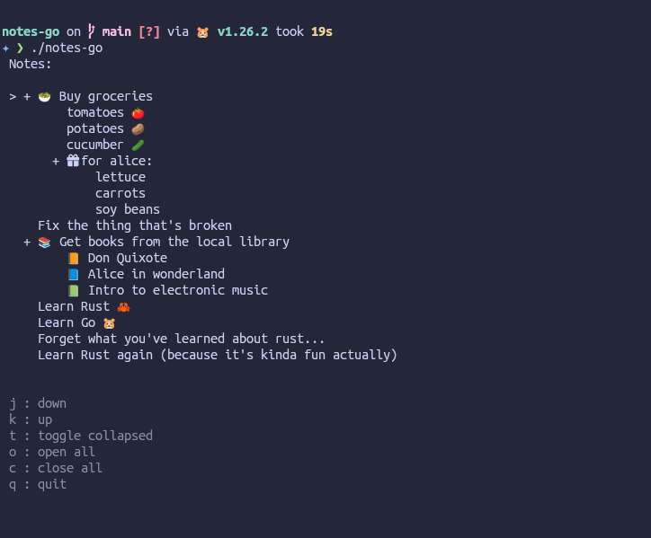

# notes-go

A note taking app with a twist. _(This is the Go TUI)_

### Wishlist

- [ ] Support for lists, items and nested list.
- [ ] Use local configuration.
- [ ] Save file to configured/default location or set it by command line args.
- [ ] Select between ASCII, Unicode, iconic, emoji, ...
- [ ] Choose between inline and full-screen (alt. buffer) accordingly.
- [ ] Collapse/expand all.
- [ ] Collapse/expand per item.
- [ ] Yank/copy to clipboard.
- [ ] Emacs/Vim keybindings.
- [ ] Add emoji suggestion for word (maybe with a trigger like ":" or "\")
  - [ ] Emoji popup while in that mode?
  - [ ] Emoji selector dialog...?

> [!TIP]
> Don't make things more complicated than needed!
> Keep it simple and you'll have a working app quickly.
> _(Yes, it's a note for myself lol)_

> [!IMPORTANT]
> Early stage of development!
> This app isn't working yet!
